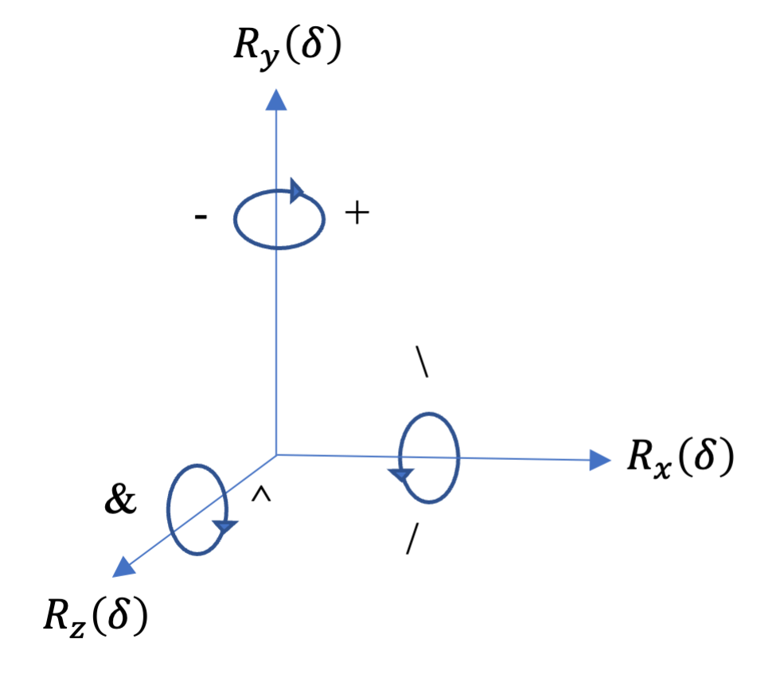

# Artificial Creation: An OpenGL-Based Generative Tool for 3D Objects

# Table of contents
1. [Introduction](#introduction) 
   1. [Background Information](#background-information)
2. [Usage](#usage)
   1. [Installing Dependencies](#installing-dependencies)
   2. [Running the Project](#running-the-project)
3. [Features](#features)
4. [FAQ](#faq)
5. [External Materials](#external-materials)
6. [Glossary](#glossary)
7. [References](#references)


## Introduction

Procedural generation has been extensively studied . <br>
Generation of 3D objects is a fascinating but challenging task that can be achieved using L-systems - a mathematical model 
created by Astrid Lindenmayer. 
L-systems are using a series of algorithms originally developed to simulate the growth of living organisms. 
They have been used for decades in [games](https://nomanssky-archive.fandom.com/wiki/Procedural_generation), 
films, visualisation purposes and [other](https://liu.diva-portal.org/smash/get/diva2:1467574/FULLTEXT01.pdf) fields.
This tool will allow you to bring your ideas to life - visualise them and save your creations.
### Background Information
To be able to take full advantage of this project let's first understand what L-systems actually are and how they are being visualised.
The idea is pretty simple - we start with a simple structure and apply rules to it to achieve more complex objects.
#### Drawing Basic Elements
Let's say we have a stem:<br>

<br>now we create a rule.<br>
> Rule 1: If you see a stem, add a branch to it.


We need a way to formally define this. To do so we introduce the concept of ```axiom``` and ```symbols```.
In our example the axiom will be the stem which visually is represented by a line being drawn forward. <br>
We can then represent the stem using the symbol ```S``` and the drawing forward operation using the symbol ```F```. <br>
We can define the rule of adding a branch as drawing a forward symbol under an angle.<br> To represent an angle we will use ```+``` for left and ```-``` for right.
Let's call a rule ```R```.
```
Axiom -> SR
S -> F
R -> -F
```


#### 'Pushing' and 'Popping' 
Let's add another branch that will go to the left. <br>
We should add a rule ```L -> +F``` and change the axiom to ```Axiom -> SRL```, right?
```
Axiom -> SRL
S -> F
R -> -F
L -> +F
```
 <br>
Well not exactly. <br> What happened here is that we started added the new branch to the previous branch.
But what we really want is to apply it to the stem. <br>
This introduces us to the concept of brackets. <br>

The symbol ```[``` and ```]``` allow us to 'push' and 'pop' a state.
This basically means that we are keeping track of where we are while applying the rules.<br>
As we will go higher and higher in the structure it will become much harder to keep track of where we are in the structure 
so we will use the square brackets as placeholders to be able to find our way back if we want to make any changes on the lower levels. <br>
Let's try this:
```
Axiom -> S[R]L
S -> F
R -> -F
L -> +F
```
This basically means:
> Draw the stem, push the state of the next commands onto the stack - branch right, 
> pop the state, we are now back to the state from before 'R' now branch left.

Et voilà, our mini 'plant' structure is there:<br>


#### List of Transformations
As we are working in a 3D space we will be using not only left and right rotations but also pitch and roll. To better understand the concept of these 3D transformations please refer to [this link](https://simple.wikipedia.org/wiki/Pitch,_yaw,_and_roll). <br>
In L-systems we define these rotations using the following ```symbols``` (constants):

| Symbol  | Interpretation                      |
|---------|-------------------------------------|
| F       | move forward and draw a line        |
| f       | move forward without drawing a line |
| +       | turn left by angle &delta;          |
| -       | turn right by angle &delta;         |
| &       | pitch down by angle &delta;         |
| ^       | turn left by angle &delta;          |
| \       | turn left by angle &delta;          |
| /       | turn left by angle &delta;          | 
| &#124;  | turn around (180&deg;)              |    

Which can be visualised as follows:<br>
<br>
Where ```R_(δ)``` represents the 3D [rotation matrices](https://en.wikipedia.org/wiki/Rotation_matrix#In_three_dimensions).

## Usage
This project is a graphics 3D procedural generation tool created using OpenGL. 
It is written in C++ and is using several third-party libraries, including GLFW, GLAD, and GLM (the full list can be found in the [External Materials](#external-materials) section.
To build and run the project, follow the instructions below.
### Installing Dependencies
The project dependencies are managed automatically by ```gitfetch```,
which allows for automatic installation of all dependencies, configures and integrates them into the project.
### Running the Project
1. Clone the repository:
```
git clone https://gitlab.com/sc20tmv/finalyearproject.git
```
2. Build the project:
```
cd project
mkdir build && cd build
cmake ..
make
```
3. Run the project:
```
./project
```
## Features
**L-system Parameters:**

- ```Generations``` &#8722; the number of generation the L-system is producing, it can either be inputted by pressing '+' and '-' buttons, as text or changed using the slider.
- ```Angle``` &#8722; the angle used by the turtle when interpreting the system, it can either be inputted as text or changed using the slider.
- ```Contextual/Parametric Input``` &#8722; the user is able to change the rules to match the input format for the contextual and parametric L-systems with the deterministic grammar input mode being the default.

**Shape Parameters:**

- ```Length``` and ```Width``` &#8722; change the length and width of the shape;
- ```Colour``` and ```Texture``` &#8722; change the rule's shape colour or apply a texture to it;<br>
   **Developmental Surface Models** allow you to additionally specify the ```angle```
   that will be used when generating the shape.<br> 
   The texture feature is yet not implemented for developmental surface models.

**Other Parameters:**
- ```Camera``` &#8722; you can adjust the position of the camera and the object (in ```x```, ```y```, ```z``` coordinates) <br> additionally the button ```Center Object``` will automatically realign the object;
- ```Lighting``` &#8722; you can adjust the position of the light source, its colour and strength; 
- ```Dark/Light Mode``` &#8722; allows to switch background colours: black (dark mode) and white (light mode) are available;
- ```Export/Import``` &#8722; save created meshes and import OBJ objects into the program using this feature. <br> The default folder for saving and loading these files is in the main directory and is called ```objects```.<br>
When specifying the object's name, ignore the ```.obj``` extension.

> **_This file is under development; further sections, examples and figures will be added._**

## FAQ
> What kind of 3D models can I create using this software?

You are able to generate deterministic and context-sensitive L-systems.

> Do I need programming experience to use this software?

No, this software provides a user-friendly environment.

> How are errors or invalid inputs handled?

Incorrect input will not be processed - nothing will happen.

> Can I import or export the models?

Yes, for further instructions refer to the [Features](#features) section.

> What operating systems is the software compatible with?

The software was tested on macOS and Linux environments, it should be running and compiling correctly on Windows.

## External Materials
```Shader```, ```Checkpoint```, ```Error```, ```Shader```, ```Mesh```, the struct ```MeshData``` and the function ```loadOBJ``` classes were used (after obtaining permission) from the material of COMP3811 module.

Used L-systems productions sources: <sup id="a1">[1](#f1)</sup>, <sup id="a9">[9](#f1)</sup>, <sup id="a10">[10](#f1)</sup>, <sup id="a11">[11](#f1)</sup>, <sup id="a12">[12](#f1)</sup>}.

Inspiration for: 
- some of the L-system classes were inspired by the implementation of the project: <sup id="a13">[13](#f1)</sup> <br>
- some of the element in the ```Camera``` and ```Window``` classes were inspired by the implementation of the project: <sup id="a14">[14](#f1)</sup> <br>
- the function ```getArcballVec``` taken from the tutorial: <sup id="a19">[20](#f1)</sup>
- the function ```loadTexture``` were implemented using the tutorials:<sup id="a19">[21](#f1)</sup>

External libraries:  ```ImGui```,  ```Glad``` and ```GLFW3``` (for project setup), ```GLM``` (for vector and matrix operations), ```STB``` (image processing).<br>
Texture files: <sup id="a15">[15](#f1)</sup>, <sup id="a16">[16](#f1)</sup>, <sup id="a17">[17](#f1)</sup>, <sup id="a18">[18](#f1)</sup>.<br>
Font: ```Noto Sans``` <sup id="a19">[19](#f1)</sup>.


## Glossary

```L-system```: A type of formal grammar used to generate complex and detailed geometric structures.<sup id="a1">[1](#f1)</sup><br>
```Axiom```: The starting symbol for an L-system.<sup id="a1">[1](#f1)</sup><br>
```Rule```: A set of instructions that define how a variable should replaced.<sup id="a3">[3](#f1)</sup><br>
```Iteration```: A single step (generation) in the growth (application of rules) of an L-system.<br>
```Production```: In the context of L-systems used interchangeably with ```Rule```.<sup id="a3">[3](#f1)</sup><br>
```Parameter```: A value that can be adjusted to affect and modify the behavior and final output of an L-system. <sup id="a4">[4](#f1)</sup> <br>
```Turtle graphics```: A method of interpreting L-systems by drawing variables as a series of movement commands. <sup id="a5">[5](#f1)</sup> <br>
```Fractal```: A geometric pattern that is self-similar at different scales.<sup id="a6">[6](#f1)</sup> <br>
```Stochastic L-system```: An L-system using probability and randomness in the set of rules.<sup id="a7">[7](#f1)</sup><br>
```OBJ File```: 3D object file type used in graphics that stored information about the geometry, texture, and materials of an object.<sup id="a8">[8](#f1)</sup> <br>
```Export```: In the project's context: The process of saving a 3D model into a file in a format that can be used to share it and import it into another application. <br>
```Import```: In the project's context: The process of loading a 3D model from a file.<br><br>
## References
<b id="f1">1</b> Prusinkiewicz, P., & Lindenmayer, A. (2004). _Algorithmic beauty of plants (2nd ed.)._ Springer. Retrieved from http://algorithmicbotany.org/papers/abop/abop.pdf [↩](#a1) <br>
<b id="f1">2</b> _L-system._ Wikipedia. Wikimedia Foundation, 29 Mar. 2022. https://en.wikipedia.org/wiki/L-system [↩](#a2) <br>
<b id="f1">3</b> _L-system._ Wikipedia. Wikimedia Foundation, 29 Mar. 2022. https://en.wikipedia.org/wiki/L-system#L-system_structure [↩](#a3) <br>
<b id="f1">4</b> _L-system._ Wikipedia. Wikimedia Foundation, 29 Mar. 2022. https://en.wikipedia.org/wiki/L-system#Parametric_grammars [↩](#a4) <br>
<b id="f1">5</b> _Turtle graphics._ Wikipedia. Wikimedia Foundation, 29 Mar. 2022. https://en.wikipedia.org/wiki/Turtle_graphics [↩](#a5) <br>
<b id="f1">6</b> _Fractal._ Wikipedia. Wikimedia Foundation, 29 Mar. 2022. https://en.wikipedia.org/wiki/Fractal [↩](#a6) <br>
<b id="f1">7</b> _L-system._ Wikipedia. Wikimedia Foundation, 29 Mar. 2022. https://en.wikipedia.org/wiki/L-system#Stochastic_grammars [↩](#a7) <br>
<b id="f1">8</b> _Wavefront .obj file._ Wikipedia. Wikimedia Foundation, 29 Mar. 2022. https://en.wikipedia.org/wiki/Wavefront_.obj_file [↩](#a8) <br>

<b id="f1">9</b> Prusinkiewicz, P., 1987. Applications of L-systems to computer imagery. In: Ehrig, H., Nagl, M., Rosenfeld, A. and Rozenberg, G. eds., Graph Grammars and Their Application to Computer Science; Third International Workshop. Springer-Verlag, Berlin, pp.534-548. doi: 10.1007/3-540-18405-5_40. [↩](#a9) <br>
<b id="f1">10</b> Hogeweg, P. and Hesper, B., 1974. A model study on biomorphological description. Pattern Recognition, 6, pp.165-179. [↩](#a10) <br>
<b id="f1">11</b> SideFX. (n.d.). L-System Node. Houdini Documentation. Retrieved April 8, 2023, from https://www.sidefx.com/docs/houdini/nodes/sop/lsystem.html. [↩](#a11) <br>
<b id="f12">12</b> Bourke, P. (1991). L-System User Notes (Version 2.5). Retrieved from http://paulbourke.net/fractals/lsys/. [↩](#a12) <br>
<b id="f13">13</b> Muhlich, J. (2021). Pomegranate. [GitHub repository]. GitHub. Retrieved from https://github.com/i-yam-jeremy/pomegranate/tree/d53ea831e8050801ba5bac828ff70e1c72b79903. [↩](#a13)<br>
<b id="f14">14</b> SaferGo. (2021). CroissantVulkanRenderer [GitHub repository]. GitHub. Retrieved from https://github.com/SaferGo/CroissantVulkanRenderer/tree/main/src/CroissantRenderer. [↩](#a14) <br>
<b id="f15">15</b> Zorak-Art. (n.d.). Stylized grass texture. Retrieved from https://skfb.ly/oyyGU. Licensed under CC Attribution-NonCommercial-NoDerivs 4.0 International (CC BY-NC-ND 4.0). [↩](#a15) <br>
<b id="f16">16</b> Pixnio. (2023). Bark Texture Wood. Retrieved from https://pixnio.com/textures-and-patterns/tree-bark-cortex/bark-texture-wood. Licensed under Creative Commons Attribution-NonCommercial-ShareAlike 2.0 Generic (CC BY-NC-SA 2.0). [↩](#a16) <br>
<b id="f17">17</b> Slater, K. (2023). Tree Bark Picture. Retrieved from https://commons.wikimedia.org/wiki/File:Tree_Bark_Picture.JPG. Licensed under Creative Commons Attribution-ShareAlike 4.0 International (CC BY-SA 4.0). [↩](#a17) <br>
<b id="f18">18</b> Unknown. (2023). Free Texture Tree Bark (22820701). Retrieved from https://commons.wikimedia.org/wiki/File:Free_Texture_Tree_Bark_(22820701).jpeg. Licensed under Creative Commons Attribution 3.0 Unported (CC BY 3.0). [↩](#a18) <br>
<b id="f19">19</b> Google. (2014). Noto Sans. Retrieved from https://www.google.com/get/noto/. Licensed under the SIL Open Font License, Version 1.1. [↩](#a19) <br>
<b id="f20">20</b> Wikibooks. (2021). OpenGL Programming/Modern OpenGL Tutorial Arcball. Retrieved April 30, 2023, from https://en.wikibooks.org/wiki/OpenGL_Programming/Modern_OpenGL_Tutorial_Arcball [↩](#a20) <br>
<b id="f21">21</b> LearnOpenGL. (n.d.). Getting started/Textures. Retrieved April 30, 2023, from https://learnopengl.com/Getting-started/Textures [↩](#a21) <br>
